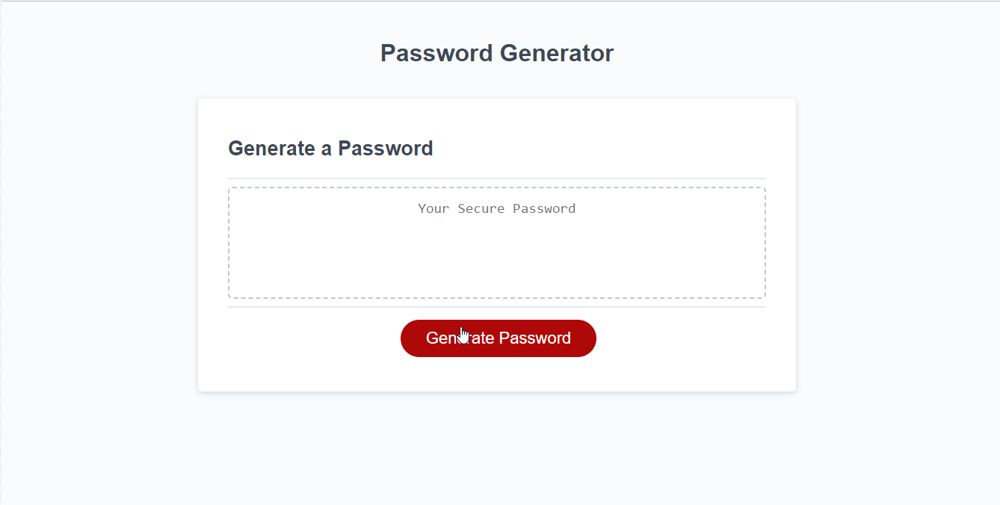

# PassGenerator
## Description
<H4>My first JavaScript Code challenge project!</H4>
<li> Modified existing code to create an application that enables employees to randomly generate passwords</li>
<li>Prompted users with password criteria</li>
<li>Applied acceptance criteria provided.</li>
<li>Created a new repository on my GitHub account and cloned it to computer.</li>
<li>Deployed project using git commands and pushed completed code to my GitHub repository.</li>

## Link To Deployed Project/Application

## Visuals

